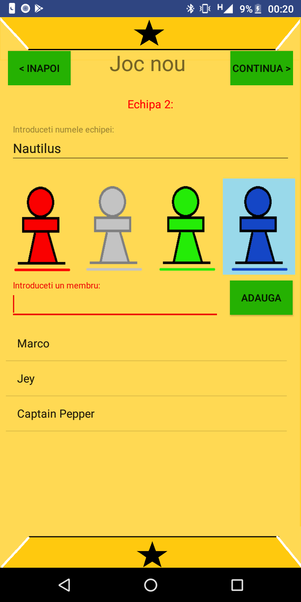
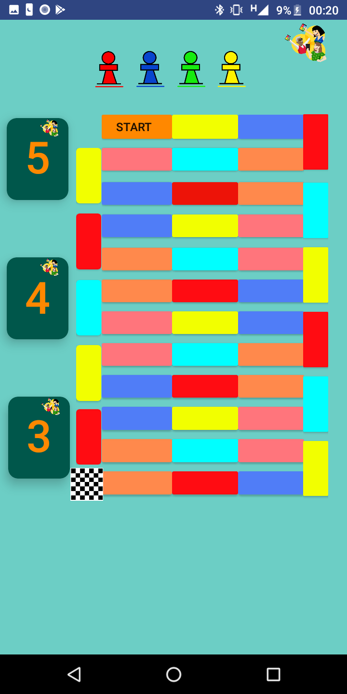
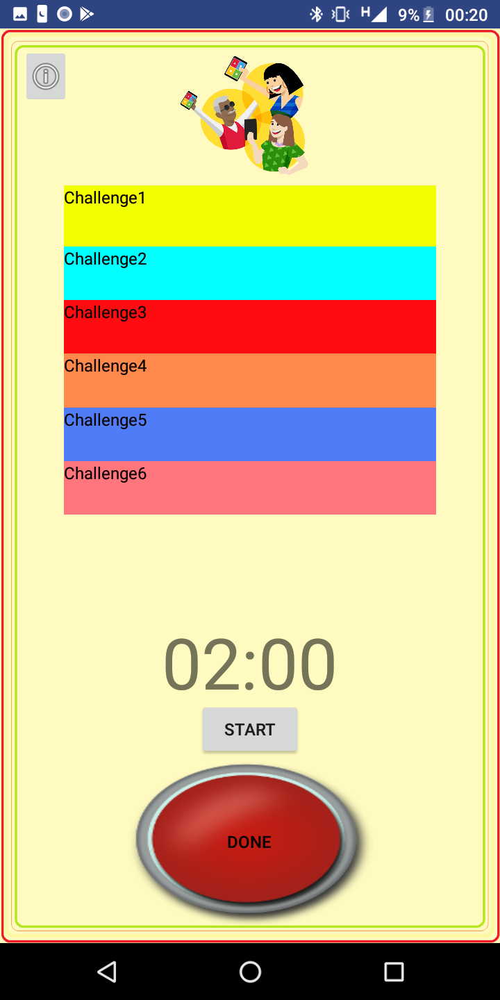
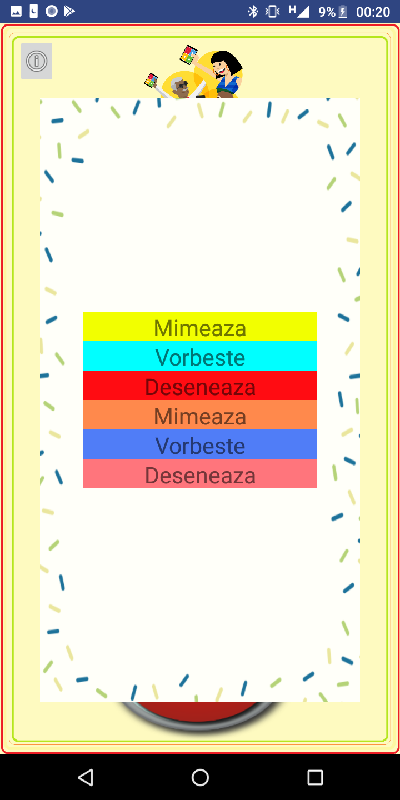
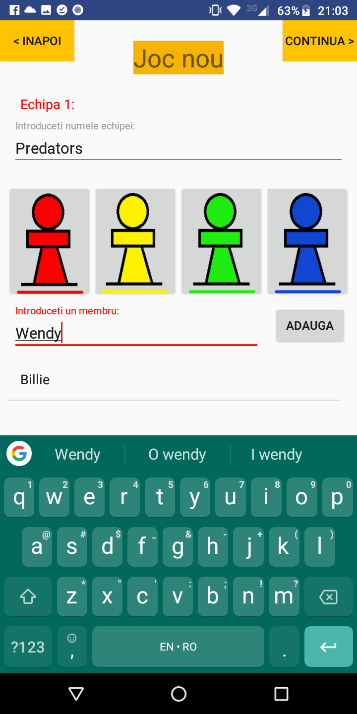
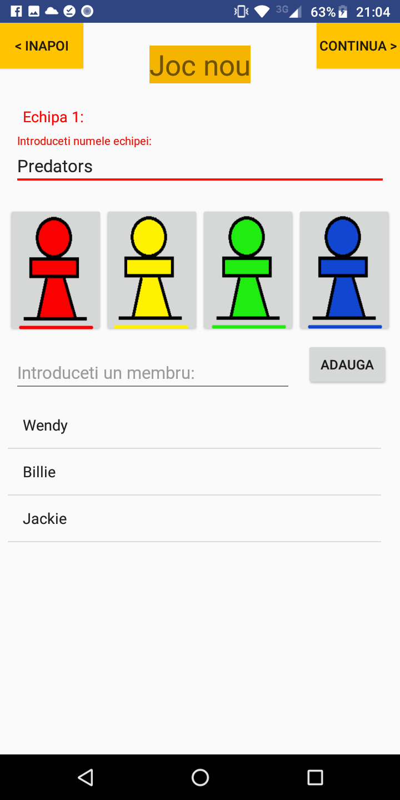
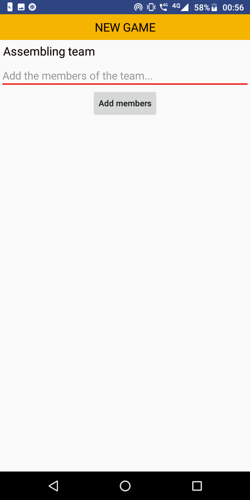
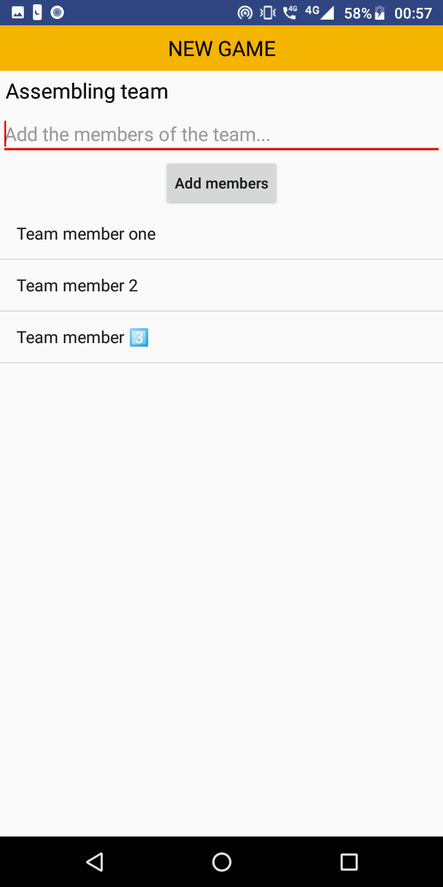

# **Activity** App

Project for the MDS laboratory that consists in an Android application coded with java who's porpouse will be 
that of a game assistant for Activity. The ideal scenario is when a big group of people are getting bored, wish 
to play some boardgame but they don't have one. That being said the app will give them the possibility to 
organise into teams, will manage the progress of each team and each team member and also will generate them the 
quest they have to accomplish in order to win.

## 'New game' features
- [x] Input team name
- [x] Choose a pawn color
- [x] Input team members
- [x] Sync inputs with the model
- [x] Cycle trough previous choices
- [ ] Alert with pop-ups

## v0.3 screenshots
<table><tr>
<th></th>
<th></th>
<th></th>
<th></th>
</tr></table>

## v0.2 screenshots
<table><tr>
<th></th>
<th></th>
</tr></table>

## v0.1 screenshots
<table><tr>
<th></th>
<th></th>
</tr></table>
